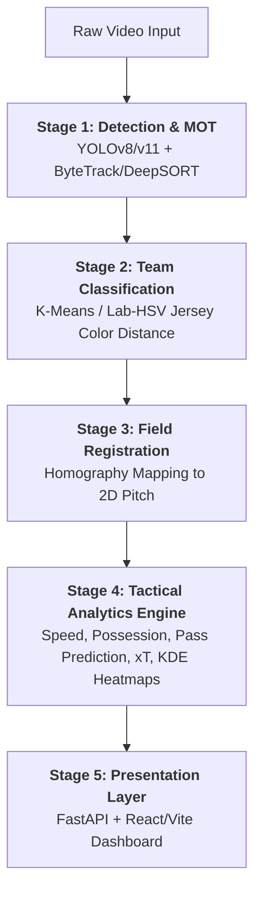

# Automated Football Match Video Analytics System


An end-to-end computer vision and tactical analysis pipeline designed to transform raw football match footage into actionable insights. This system provides real-time multi-object tracking, team classification, pitch registration, and advanced tactical metrics through an interactive dashboard.

---

## 🏗️ Five-Stage Pipeline Architecture

The system operates through a sophisticated sequential pipeline, moving from raw pixel data to high-level tactical intelligence.



### 1. Detection & Multi-Object Tracking (MOT)
Utilizes **YOLOv8/v11** fine-tuned for football-specific entities (players, referees, ball, goalkeepers). Temporal consistency is maintained using **ByteTrack** or **DeepSORT**, ensuring unique ID persistence across occlusions and fast-moving transitions.

### 2. Jersey-Color Team Classification
Employs **K-Means clustering** on the upper-half of player bounding boxes to extract dominant jersey colors. Classification is performed using a distance-based model (Lab or HSV space) to assign players to their respective clubs with high precision, even under varying lighting conditions.

### 3. Perspective Field Registration
Automates pitch localization using keypoint detection. A **Homography matrix ($H$)** is computed to map screen coordinates to a normalized 105m x 68m top-down 2D representation. This enables accurate spatial measurements regardless of camera angle.

### 4. Tactical Analytics Engine
The core intelligence layer:
*   **Speed Estimation:** Real-time velocity tracking in km/h using smoothed displacement on the 2D pitch.
*   **Proximity Possession:** Heuristic-based ball assignment to players based on spatial proximity and temporal grace periods.
*   **Pass Vector Prediction:** Evaluates potential passing lanes by scoring candidates based on angle-to-goal, opponent density, and lane clearance.
*   **Expected Threat (xT):** Real-time scoring of attacking threat based on ball position, angle, and defensive pressure.
*   **KDE Heatmaps:** Generates Kernel Density Estimation maps to visualize player spatial dominance and positioning trends.

### 5. Presentation Layer
A modern stack featuring a **FastAPI** backend for asynchronous processing and a **React/Vite** frontend. The interactive dashboard visualizes threat levels, pass options, and possession statistics in real-time.

---

## 📐 Mathematical Formulations

### Homography Transformation
To map a point from the image plane ($P_{screen}$) to the pitch plane ($P_{pitch}$):

$$P_{pitch} = H \cdot P_{screen}$$

Where $H$ is the $3 \times 3$ homography matrix computed from matched keypoints.

### Expected Threat (xT) Scoring
Attacking threat is quantified using the following heuristic:

$$xT = \frac{ZoneWeight \times AngleFactor}{PressureFactor}$$

*   **ZoneWeight:** Exponential decay based on distance to the opponent's goal.
*   **AngleFactor:** Angular alignment of the ball/pass with the goal mouth.
*   **PressureFactor:** Inverse relationship with the density of nearby opponents.

---

## 📊 Data Schema (JSON Export)

The system exports comprehensive tracking data via `TracksJsonWriter` for downstream analysis.

### Object Tracks (`object_tracks.json`)
```json
{
  "frame_num": {
    "player": {
      "id_1": {
        "bbox": [x1, y1, x2, y2],
        "club": "Team A",
        "club_color": [R, G, B],
        "projection": [x_norm, y_norm],
        "has_ball": false,
        "speed": 24.5
      }
    },
    "ball": {
      "0": { "bbox": [...], "projection": [...] }
    }
  }
}
```

### Pass Predictions (`pass_predictions.json`)
```json
{
  "frame": 450,
  "passer_id": 12,
  "target_id": 7,
  "type": "through",
  "score": 0.88,
  "meta": {
    "angle_to_goal": 15.2,
    "lane_blocked": false,
    "opponent_density": 1
  }
}
```

---

## 🛠️ Setup & Installation

### 1. Backend Environment
Requires Python 3.10 and Conda.
```bash
# Create and activate environment
conda env create -f football_env_clean.yml
conda activate football_analytics

# Ensure models are in place
# Place your trained .pt weights in models/weights/
```

### 2. Frontend Dashboard
```bash
cd client
npm install
npm run dev
```

### 3. Running Analysis
Execute the main pipeline or start the web server:
```bash
# CLI Processing
python main.py

# Backend Server
python backend.py
```

---

## 📁 Model Weights Guide
Place your YOLO weights as follows to ensure compatibility with the `ObjectTracker` and `KeypointsTracker`:
*   `models/weights/object-detection.pt`: YOLOv8/v11 model for players, ball, and goal.
*   `models/weights/keypoints-detection.pt`: Keypoint detection model for pitch corners and markings.

---
*Developed for professional tactical analysis and automated broadcasting insights.*
